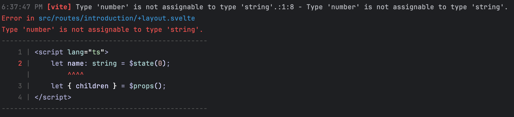
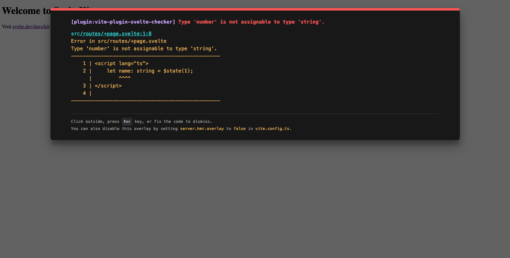

# Vite-Plugin-Svelte-Checker

A Vite plugin for checking Svelte files with Typescript support.





# Try It Online

You can try this plugin directly in your browser using this [StackBlitz example](https://stackblitz.com/edit/vitejs-vite-s9hpfhhs?file=src%2FApp.svelte).

# Installation

```bash
npm install vite-plugin-svelte-checker --save-dev
```

# Usage

```tsx
// vite.config.ts

import {defineConfig} from 'vite'
import {svelteChecker} from 'vite-plugin-svelte-checker'

export default defineConfig({
    plugins: [
        svelteChecker({
            // configuration options
        })
    ]
})
```

# Configuration Options

Below are the available configuration options for the plugin:

| Option               | Type                                                 | Default | Description                          |
|----------------------|------------------------------------------------------|---------|--------------------------------------|
| typescript           | boolean, `{ tsConfigPath: string }`                  | `true`  | Enable TypeScript checking           |
| cli                  | boolean, `{ theme: BundledTheme, enabled: boolean }` | `true`  | Display CLI checker results settings |
| overlay              | boolean                                              | `true`  | Display browser overlay settings     |
| ignoreWarnings       | boolean                                              | `false` | Ignore warning-level diagnostics     |
| eslint (coming soon) | TBD                                                  | `false` | Enable ESLint checking               |

# Methods

## svelteChecker(options)

Creates a new instance of the Svelte checker plugin.

### Parameters

- `options`: Configuration object (optional)

# Example

## Basic Configuration

```ts

import {defineConfig} from 'vite'
import {svelteChecker} from 'vite-plugin-svelte-checker'

export default defineConfig({
    plugins: [
        svelteChecker({
            typescript: true,
            ignoreWarnings: false
        })
    ]
})
```

# Contributing

Contributions are welcome! 

# License

This project is licensed under the MIT License - see the LICENSE file for details.